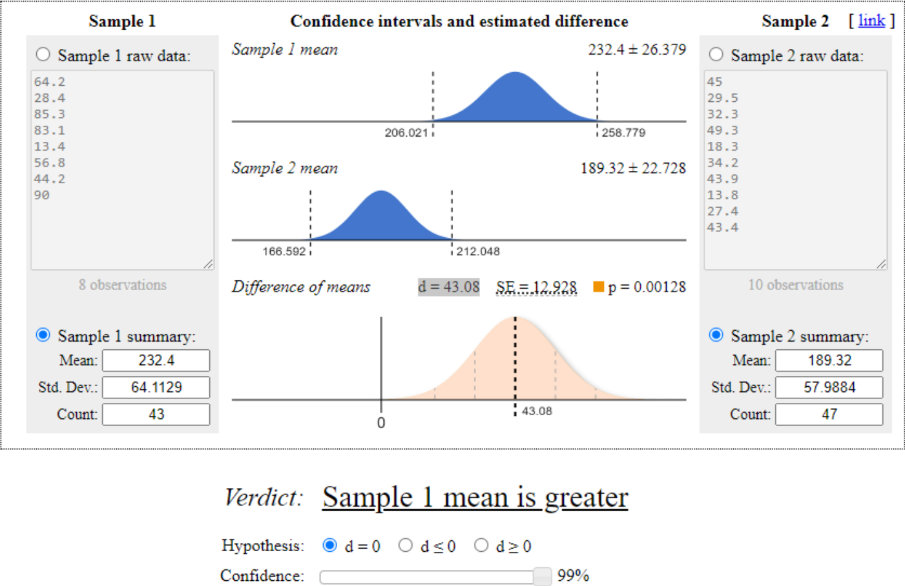
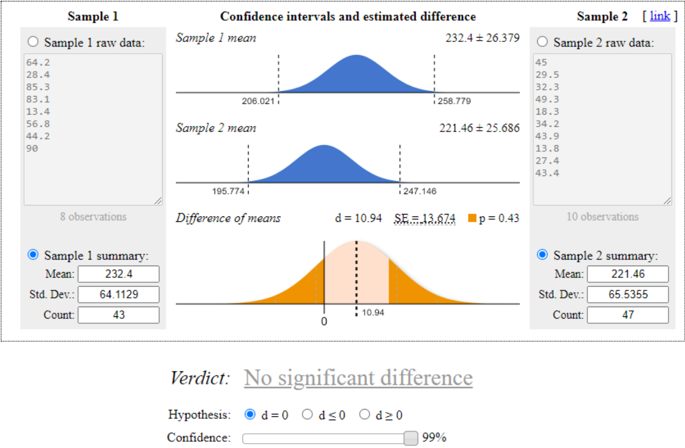
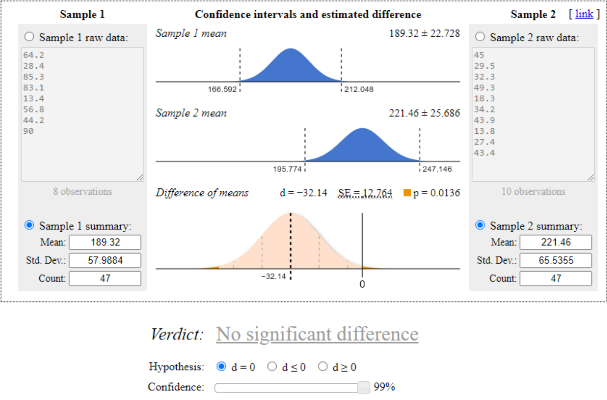

# Fast Food Marketing Campaign A/B Test Analysis

## Project Overview

The objective of this project was to analyze the effectiveness of three different marketing campaigns for promoting a new menu item at a fast-food chain. Using A/B testing and statistical analysis, I aimed to identify which campaign would have the greatest effect on sales. 

Since this was a learning task, it’s scoped to be a quick analysis rather than a comprehensive project.

## Dataset Information

The dataset for this project is publicly available on Kaggle and can be accessed [here](https://www.kaggle.com/datasets/chebotinaa/fast-food-marketing-campaign-ab-test). It contains records of weekly sales across different locations where each of three marketing campaigns was tested for a new menu item.

This dataset does not specify an explicit license, however, acknowledged source is IBM Watson Analytics community. 

## Tech Stack

- **SQL (BigQuery)** – for data extraction and calculations.
- [**Evan Miller’s T-Test Tool**](https://www.evanmiller.org/ab-testing/t-test.html) – for conducting the t-tests.

## Methodology

1. **Multiple testing considerations**

    Since this analysis compares three samples, there is a higher risk of a multiple testing problem, increasing the chance of a type I error (false positive). To address this, I used a confidence level of 99% to minimize the likelihood of such errors.

2. **Random assignment check**

    I verified that campaigns were randomly assigned across locations. Campaign 1 was assigned to 43 locations, while Campaigns 2 and 3 were each assigned to 47 locations. After calculating the sample ratio interval for a 99% confidence interval, I confirmed no sample ratio mismatch.

3. **Hypothesis definition and statistical testing**

    - **The primary metric** for comparison was average sales per location (in thousands).
    - **Hypotheses**:
        - **Null Hypothesis (H0)**: μ1 = μ2 = μ3. There is no statistical difference between the mean sales of the campaigns.
        - **Alternative Hypothesis (H1)**: μ ≠ μ. There is a statistical difference between the mean sales of at least two campaigns.
    - I conducted **paired t-tests** to compare the mean sales of each campaign. A t-test was used instead of a z-test due to an unknown population standard deviation (n >= 30). Source [Bloomington Tutors](https://bloomingtontutors.com/blog/when-to-use-the-z-test-versus-t-test#:~:text=When%20you're%20working%20on,test%20problems%20%2D%20always%20use%20z). 

## Results

### Campaign Descriptive Statistics

The average sales and standard deviations were calculated for each campaign to compare their performance.

| Promotion | Locations Count | Average Sales | Standard Deviation |
|:----: |:----: |:----: |:----: |
| 1         | 43              | 232.4k        | 64.1129            |
| 2         | 47              | 189.32k       | 57.9884            |
| 3         | 47              | 221.46k       | 65.5355            |

### Paired T-Test Results

#### Campaign 1 vs Campaign 2

    

T-test result: p = 0.00128, difference (d) = 43.08. Campaign 1 significantly outperformed Campaign 2 with a p-value < 0.01.

#### Campaign 1 vs Campaign 3
    

    

T-test result: p = 0.43, difference (d) = 10.94. No statistically significant difference between Campaign 1 and Campaign 3 as p > 0.01.

#### Campaign 2 vs Campaign 3
    

    

T-test result: p = 0.0136, difference (d) = −32.14. No statistically significant difference between Campaign 2 and Campaign 3 as p > 0.01. It  was very close to also outperforming the 2nd campaign, however, according to the chosen significance level, not to the same extent as the 1st one.

## Recommendations

Based on the analysis, the recommended marketing campaign is Campaign 1. Although Campaign 3 performed closely to Campaign 1, Campaign 1 was the only one that showed a statistically significant difference compared to Campaign 2. This gives me higher confidence in Campaign 1’s effectiveness in increasing sales.

### Suggested Actions

1. **Implement Campaign 1 for new product launch**

    Given Campaign 1’s strong performance, I recommend rolling out this campaign for the upcoming menu item across all locations.

2. **Consider further testing of campaign 3**

    Given its comparable performance to Campaign 1, I suggest in the future refining Campaign 3 and running an additional A/B test to explore its potential as a possible alternative for other new product releases.

3. **Incorporate cost-benefit analysis for future campaign decisions**

    The current data focused on sales per location without assessing the cost of each campaign. For future A/B tests, to include a cost-benefit analysis, business would need to include campaign cost data as well. It would help to compare the effectiveness of each based on sales generated relative to campaign expenses. This approach could reveal which ones yield the highest return on investment.

## Possible Analysis Improvements

1. **Segment analysis by market size and store age** 

    There are only 548 rows of data, but if sample sizes would be enough, it could help to uncover patterns in campaign effectiveness based on market characteristics or store maturity. 

2. **Detailed weekly performance comparison** 

    Examining weekly performance trends for each campaign across the four weeks could reveal how quickly customer interest decays or sustains for each promotion. This analysis could help identify if a campaign has stronger initial impact versus sustained performance and provide insights into optimal campaign duration.

3. **Exploring possibilities of other statistical tests, like ANOVA** 

    If needed assumptions are met, running test like ANOVA could provide a more robust statistical approach than pairwise t-tests, reducing the likelihood of Type I errors from multiple testing. 

4. **Investigate outliers and variability across locations** 

    The standard deviations for each campaign are relatively high, suggesting variability in performance across locations. Analyzing location-specific outliers and understanding why certain locations performed significantly better or worse under each campaign could provide insights into factors driving these differences, such as regional preferences or local competition.

## How to Use This Repository

- **"SQL_aggregation_for_ab_test"** - SQL query for needed data aggregations.
- **"images"** - contains screenshots of t-test results for each campaign comparison.

## Contact

LinkedIn - [Agnė Vabalaitė](www.linkedin.com/in/agnė-vabalaitė).
Gmail - vab.agne@gmail.com